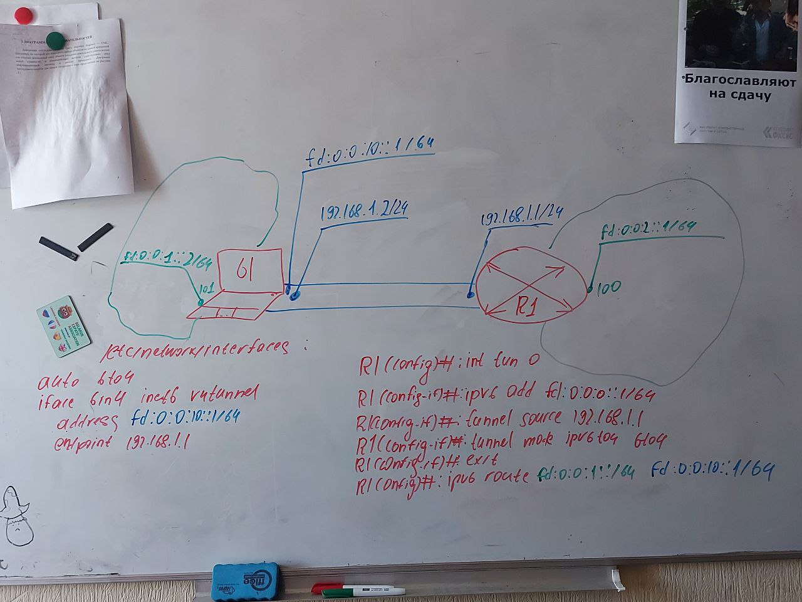

# Администрирование компьютерных сетей

## Глоссарий IPv6 болота

- Link-local All Nodes Multicast (FF02::1/128)
- Link-local All Routers Multicast (FF02::2/128)
- Solicited-node multicast address (FF02::1:FF00:0/104)
- IPv6 multicast address prefix - _33:33:00:00:00:00_ OR'd with the _last 32 bits of the IPv6 address_

## Структура билета

- Введение
- Основные термины
- Рисунки
- Заключение

## 58. Восстановление параметров при IPv6-автоконфигурировании

Предусмотрены две базовых модели автоконфигурирования:

1. SLAAC -- **StateLess Address** AutoConfiguration. Характерно **распределенное управление**, адреса и другие параметры конфигурируют с помощью служебных сообщений, базируется на **ICMPv6**
2. Stateful -- **централизованное управление**, адреса и другие параметры передаются по специально протоколу, базируется на **DHCPv6**.

Задачи ND в рамках восстановления параметров:

- Восстановление значений префиксов подсетей
- Восстановление значений некоторых других параметров (например,
  MTU, DNS, Маршуты)
- Восстановление MAC-адресов соседних станций (вместо IPv4 ARP)

### Алгоритм восстановления MAC-адреса

1. NS (Neighbor Solicitation)

- MAC SRC (MAC устройства)
- MAC DST (_33:33:00:00:00:00_ OR'd with Link-local All Nodes Multicast (FF02::1/128) - **_33:33:00:00:00:01_**)
- IP SRC (IPv6 адрес устройства)
- IP DST (Solicited-node multicast address + 24 крайних битов IPv6 устройства назначения)
- ICMPv6 - NS
- NS: Target Address - IPv6 устройства назначения; Option - Source Link-layer Address = MAC устройства

2. NA (Neighbor Advertisement)

- MAC SRC (MAC устройства)
- MAC SRC (MAC назначения)
- IP SRC (IPv6 адрес устройства)
- IP DST (IPv6 назначения)
- ICMPv6 - NA
- NA: Target Address - IPv6 устройства назначения; Flags = R=0,S=1,O=1; Option = Target Link-layer address = MAC устройства

### Алгоритм получения конфигурации от маршутизатора

1. RS (Router Solicitation)

- MAC SRC (MAC устройства)
- MAC DST (_33:33:00:00:00:02_ OR'd with Link-local All Routers Multicast (FF02::2/128) - **_33:33:00:00:00:02_**)
- IP SRC (IPv6 адрес устройства)
- IP DST (Link-local All Routers Multicast)
- ICMPv6 - RS
- NS: Target Address - IPv6 устройства назначения; Option - Source Link-layer Address = MAC устройства

2. RA (Router Advertisement)

- MAC SRC (MAC устройства)
- MAC SRC (MAC назначения)
- IP SRC (IPv6 адрес устройства)
- IP DST (IPv6 назначения)
- ICMPv6 - RA
- RA: CurHopLimit=64, Router Lifetime = 1800, Reachable Time = 0, Retrans Timer = 0; Flags = M=0, O=0, H=0; Options = Source Link-layer Address=MAC устройства; MTU = 1500, PrefixInfromation

# 70. Поддержка совместимости IPv6 с IPv4 в Windows, Linux и IOS

Туннелирование – передача пакетов уровня Lx вкладывая их в пакеты того же уровня Lx.

В Cisco поддерживаются следующие основные режимы туннелирования IPv6-over-IPv4

- ipv6ip – manual
- ipv6ip 6to4 – 6to4
- ipv6ip isatap – ISATAP
- gre IPv6 – GRE(Generic Routing Encapsulation)

В последних версиях Windows по умолчанию запрещены все туннельные интерфейсы IPv6-over-IPv4 (6to4, ISATAP (Intra-Site Automatic Tunnel Addressing Protocol) и Teredo). Их можно разрешить, изменив соответствующие биты в значении ключа реестра. Настройка туннеля осуществляется через команду `netsh interface ipv6`.

### Варианты команды netsh interface ipv6:

```
> netsh interface ipv6 6to4 set state state=enabled|disabled|default
> netsh interface ipv6 isatap set state state=enabled|disabled|default
> netsh interface ipv6 set teredo type=disabled|client|enterpriseclient|server|default
```

Для конфигурации туннеля в Linux нужно настроить его в файле, находящемся по пути `/etc/network/interfaces`

### Настройка туннеля Linux

```
auto 6in4
iface 6in4 inet6 v4tunnel
    address fd:0:0:10::1 (IPv6 source)
    netmask 64
    endpoint 192.168.1.1 (IPv4 destination)
```

Также можно настроить туннель с помощью утилиты nmcli

Конфигурация туннеля в IOS осуществляется после перехода в соответсвующий режим командой interface tunnel. После можно использовать команду tunnel.

### Пример настройки туннеля Cisco IOS:

```
R1(config)# int tun 0
R1(config-if)# ipv6 add fd:0:0:0::1/64
R1(config-if)# tunnel source 192.168.1.1
R1(config-if)# tunnel mode ipv6ip 6to4
R1(config-if)# exit
R1(config)# ipv6 route fd:0:0:1::/64 fd:0:0:10::1
```



# 76. Защита информации, передаваемой по открытым сетям

Безопасность – обеспечение защиты информации, передаваемой в открытых для прослушивания сетях.

### При обеспечении безопасности в сетях решаются следующие задачи:

- Аутентификация – обеспечения гарантии того, что сообщение пришло от того, кому оно назначалось. Для обеспечения такой гарантии используются ключи. Алгоритмы аутентификации: **PSK**, **RSA**
- Целостность – обеспечение гарантии что сообщение не было повреждено при пересылке и не было совершено подменено изначальных данных. Для гарантии используются хэш-функции. В качестве примеров можно привести такие хеш-функции, как: **MD5**, **CRC32**, **SHA-256**, **HAS-160**.
- Конфиденциальность – обеспечение гарантии что перехваченное сообщение не может быть прочитано. Для решения данной задачи используются алгоритмы шифрования. Примеры: **3DES**, **AES**, **Blowfish**

Также как вариант обеспечения безопасности данных при передаче можно использовать алгоритмы стеганографии – сокрытие конфиденциальных данных под неконфиденциальными. Примеры:

- Прятать данные внутри сигнала
- Прятать данные внутри метаданных
- Скрывать с помощью алгоритмов внутри фото

Для обеспечения безопастности также используется цифровые подписи и цифровые сертификаты

Тенденции в области безопасности сводятся к формированию Виртуальных частных сетей(VPN) охватывающие взаимодействующие станции. Взаимодействие происходит по Виртуальным частным каналом, которые представляют собой защищенный туннель, прокладываемый через открытые сети

Также для достижения безопасности Cisco использует такую технологию ACL(список управления доступом). Которая заключается в установке на входящем направлении ACL, который блокирует и не пропускает избыточный трафик. Он заглядывает в IP-пакет и просматривая его тип и порты.

При обеспечении безопасности исползуется две основные политики:

- Разрешено все, что явно не запрещено.
- Запрещается все, кроме того что разрешено.

Cisco пользуется методологией security wheel для достижения безопасности. Она заключается в том что есть 4 состовляющие:

- Secure(Безопасность)
- Monitor(Наблюдение)
- Test(Тестирование)
- Improve(Доказательство)
